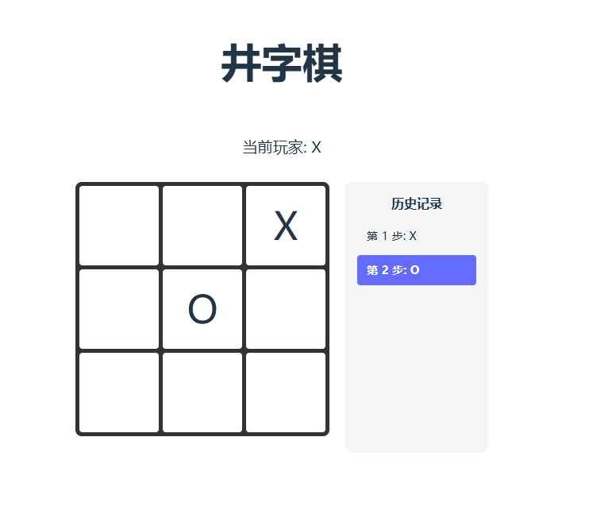

# 井字棋游戏

一个使用 React + Vite 构建的经典井字棋游戏，支持时间回溯功能。

## 预览



## 功能特性

- ✅ 双人对战（X 和 O 轮流落子）
- ✅ 自动判定胜负和平局
- ✅ 历史记录查看
- ✅ 时间回溯（点击历史步骤跳转）
- ✅ 游戏结束弹窗

## 技术栈

- **React 19** - 函数组件 + Hooks
- **Vite 7** - 快速开发构建工具

## 项目结构

```
src/
├── constants/       # 游戏常量配置
├── utils/          # 游戏逻辑工具函数
├── hooks/          # 自定义 Hooks
├── components/     # React 组件
└── App.jsx         # 主应用组件
```

## 快速开始

```bash
# 安装依赖
npm install

# 启动开发服务器
npm run dev

# 构建生产版本
npm run build
```

## 核心实现

- **自定义 Hooks**：`useGameState` 管理游戏状态，`useGameHistory` 管理历史记录
- **纯展示组件**：所有子组件均为纯展示组件，逻辑集中在 Hooks 中
- **标准 JSDoc**：完整的代码注释文档

## License

MIT